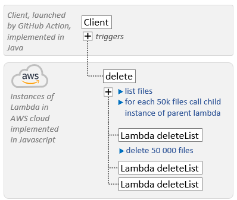

# Small Json Files Test Fixture

[](https://github.com/exasol/small-json-files-test-fixture/actions/workflows/ci-build.yml)
[](https://search.maven.org/artifact/com.exasol/small-json-files-test-fixture)

[](https://sonarcloud.io/dashboard?id=com.exasol%3Asmall-json-files-test-fixture)

[](https://sonarcloud.io/dashboard?id=com.exasol%3Asmall-json-files-test-fixture)
[](https://sonarcloud.io/dashboard?id=com.exasol%3Asmall-json-files-test-fixture)
[](https://sonarcloud.io/dashboard?id=com.exasol%3Asmall-json-files-test-fixture)
[](https://sonarcloud.io/dashboard?id=com.exasol%3Asmall-json-files-test-fixture)

[](https://sonarcloud.io/dashboard?id=com.exasol%3Asmall-json-files-test-fixture)
[](https://sonarcloud.io/dashboard?id=com.exasol%3Asmall-json-files-test-fixture)
[](https://sonarcloud.io/dashboard?id=com.exasol%3Asmall-json-files-test-fixture)
[](https://sonarcloud.io/dashboard?id=com.exasol%3Asmall-json-files-test-fixture)

Test fixture with many small JSON files on S3.

SJFTF can be used for creating datasets with about 1,000,000 files on S3. Doing this from a local PC would take very long, since the connections over the internet have high latency. For that reason SJFTF creates the files using many parallel lambda functions directly in the AWS Cloud.

The setup consists of JSON files like:

```json
{
  "id": 1,
  "name": "teinge1Chah0esh2shee"
}
```

`Id` is a consecutive number, `name` a random string with 20 characters.

## Usage

```java
new SmallJsonFilesTestSetup(awsCredentialsProvider,
        Map.of("exa:project", "MYPROJ", "exa:owner", "me@example.com"),
        "myBucket"
    ).setup(1_000_000 /* total number of files */);
```

This will create the files in the bucket if it's not already there. It will **not** delete the setup. The idea is that you keep the files in your account.

Currently only region `eu-central-1` is supported.

## Costs

Creating 1,000,000 S3 objects costs about $5. Compared to that the costs for storage are low, since the files are so small.

## Architecture

Creating and deleting many small files in S3 requires many HTTP requests. To reduce network latency for each request and by that speed up the execution SJFTF delegates the requests to an AWS Lambda. The implementation is therefore split into
* a client library written in Java
* and lambda code written in JavaScript.

### Deleting Files

The time required for deleting files is dominated by the time to list all files in S3 as listing only returns 1,000 files at a time. The Java client therefore needs to call the parent instance of the lambda with request action type `delete` multiple times.

Please note that using this approach SJFTF can only delete around 1,100,000 files before exceeding the max. duration of 15 minutes for the parent instance of the lambda function.



### Creating Files

To speed up creating files, the Java code invokes multiple lambdas in parallel with request action type `create`.

SJFTF needs to consider the following constraints when creating the files in S3 buckets:
* AWS Lambdas have a maximum runtime of 15 minutes, so SJFTF can't create all files in a single lambda.
* The number of concurrent requests to S3 is limited. When invoking too many lambdas in parallel, S3 causes a failure with error "*SlowDown: Please reduce your request rate*".
* The recommended solution to use a random hash in the file name for improved S3 partitioning didn't work.

Instead SJFTF uses the following approach:
* The Java client invokes the Lambdas synchronously.
* Additionally the client increases the read timeout for the S3 library's HTTP client to more than 15 minutes.
* Each lambda creates only 5,000 files to avoid a timeout for the HTTP request observed by the GitHub Action, see issue [#24](https://github.com/exasol/small-json-files-test-fixture/issues/24).
* The Java client uses a thread pool to limit the max. number of concurrent lambdas to 75.


We tried using the asynchronous client for AWS Lambda and limiting the maximum number of allowed concurrent requests to 50. The first 50 requests succeeded but the others failed with error "*Signature expired: ... is now earlier than ...*". It seems that all requests including their signature are created when they are scheduled, so that the signature is expired once they are executed. The simplest solution was to use the synchronous Lambda client using a fixed thread pool.

## Additional Information

* [Changelog](doc/changes/changelog.md)
* [Dependencies](dependencies.md)
